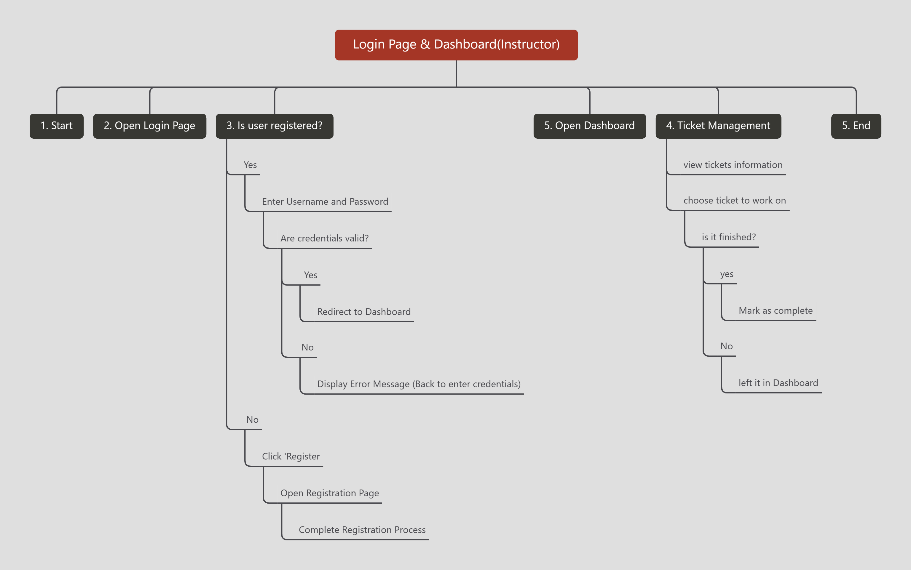

# Our Hour Requirements and Specifications Doc

2023-04-07 / v2.6

## Introduction

OurHour is a streamlined system designed to manage college course office hours. It effectively connects students and TAs, simplifying scheduling and enhancing time management. The system offers tailored features for TAs, such as session details and student information, and provides students with easy access to scheduling, session types, and private communication with TAs.

## About

### Group Members

- Eric Harrigan
- Karim Matouk
- Khalid Shallhoub
- Raisa Riddhi
- Ritwick Dwivedi
- Yinzhou Wen

### Document Revision History

| Date / Version    | Comments                                                                                  |
| ----------------- | ----------------------------------------------------------------------------------------- |
| 2023-02-23 / v1.0 | Initial                                                                                   |
| 2023-02-23 / v1.1 | Added to customer, and user requirements                                                  |
| 2023-02-23 / v1.2 | Added project abstract & security reqs                                                    |
| 2023-02-23 / v1.3 | Added user interface requirements                                                         |
| 2023-03-08 / v1.4 | Added system requirements                                                                 |
| 2023-03-09 / v1.5 | Added ERD to Specifications                                                               |
| 2023-03-09 / v1.6 | Added mockup pages                                                                        |
| 2023-04-01 / v2.0 | Updated ERD to match real DB schema                                                       |
| 2023-04-02 / v2.1 | Added UML diagram                                                                         |
| 2023-04-05 / v2.2 | Added test server and domain information                                                  |
| 2023-04-07 / v2.3 | Add screenshots of UI programs                                                            |
| 2023-04-07 / v2.4 | Reorganize the document structure to include a mind map as the document table of contents |
| 2023-04-18 / v2.5 | Adjusted Security requirements as new potential security exploits found                   |
| 2023-04-20 / v2.6 | Added per page flowchart for navigation                                                   |
| 2023-04-20 / v2.6 | Updated Authentication process                                                            |

## Customer

OurHour is a system designed to manage office hours sessions in college courses. The primary goal is to effectively connect students and their respective TAs, offering ease of access to office hours sessions and better time management for all users. The system focuses on two main aspects: serving TAs and serving students.

### Serving TAs and Professors

OurHour aims to provide TAs and Professors with easy access to their office hours schedule and manage any upcoming sessions with students. The system offers features such as:

-   Displaying the number of overall sessions available for a certain day
-   Access to student names
-   Session information (i.e., single session vs. group)
-   And many other features

### Serving Students

The system also aims to serve students by allowing ease of access to office hours' scheduling. It offers various features, such as:

-   Viewing office hours session types
-   Access to session time and date
-   Allowing private communication with TAs for issues regarding an upcoming session

By focusing on these aspects, OurHour strives to improve the overall experience of office hours sessions for both TAs and students in college courses.

## Functional Requirements

1.  User authentication: Both students and TAs must be able to register and log in to their respective accounts.
2.  Schedule management: TAs should be able to create, modify, and cancel office hours.
3.  Queue management: Students must be able to join a queue for office hours, see their position in the queue, and receive notifications when it's their turn.
4.  Communication: TAs and students should be able to communicate via text chat during office hours.
5.  Session notes: Students can provide notes about their questions or concerns when joining the queue, allowing TAs to prepare in advance.
6.  Group sessions: TAs should have the option to create group sessions, where multiple students can join and participate simultaneously.
7.  Administration: System administrators should be able to manage user accounts and access settings.

## Non-Functional Requirements

1.  Usability: The application must be easy to use, with a clean and intuitive user interface for both students and TAs.
2.  Accessibility: OurHour should be compatible with various devices, including desktop computers, laptops, tablets, and smartphones.
3.  Performance: The system must handle a large number of users simultaneously without compromising its speed or functionality.
4.  Scalability: OurHour should be easily expandable to accommodate future growth and additional features.
5.  Security: User data, including personal information and session notes, must be securely stored and protected from unauthorized access.
6.  Reliability: The application should be stable and reliable, with minimal downtime and prompt technical support when needed.

## Use Cases

### Change/End Office Hours

**Actors**: Instructors

**Triggers**: Instructor clicks the "Change/end office hours" button.

**Events**: The instructor is prompted to supply an end time that is in the future on the current day, or to indicate that they want to end the office hours now. If the instructor chooses to end the office hours now, they are prompted to confirm that choice.

**Exit Condition**: The instructor supplies a valid end time or confirms that they want to end the office hours.

**Post Conditions**: If the office hours end time was changed, the site shows the updated end time for both students and instructors. If the office hours were ended, any students still in the queue are notified that the office hours have ended and they will not be helped. These tickets are marked as "cancelled".

**Acceptance Test**: If the office hours were updated, the new end time is available for both students and instructors to view on their respective pages. When the end time arrives, all waiting tickets are cancelled and those students are notified. Students cannot submit tickets after the office hours close, unless it reopens. If the office hours were closed, that behavior is equivalent to changing the end time to now.

### Cancel Ticket

**Actors**: Instructors

**Triggers**: Instructors click "Cancel ticket" button while viewing a ticket in the queue.

**Events**: Instructor is prompted to confirm that they wish to cancel the ticket.

**Exit Condition**: Instructor confirms that they wish to cancel this ticket.

**Post Conditions**: The student is notified that their ticket has been cancelled.

**Acceptance Test**: When the student tries to view their ticket on the manage ticket page, it shows that it is cancelled. If an instructor views the ticket in the queue, its status will be cancelled.

### View Ticket Queue

**Actors**: Instructors

**Triggers**: Instructor accesses the ticket queue.

**Events**: The instructor is presented with a list of tickets that are currently in the queue, sorted by submission time.

**Exit Condition**: The instructor views the ticket queue.

**Post Conditions**: The instructor can interact with the tickets in the queue, such as answering, cancelling, or updating ticket status.

**Acceptance Test**: The instructor can successfully view and interact with the tickets in the queue. Any changes made by the instructor are visible to the affected students and reflected on the ticket status page.

### Submit Ticket

**Actors**: Students

**Triggers**: Student clicks the "Submit ticket" button.

**Events**: The student fills out the required information, such as name, email, and question, then submits the ticket.

**Exit Condition**: The student submits a ticket with valid information.

**Post Conditions**: The submitted ticket is added to the queue and is visible to the instructors. The student receives a confirmation and can view their ticket status.

**Acceptance Test**: The student successfully submits a ticket, and it appears in the queue for instructors. The student can view the status of their ticket on the manage ticket page.

### Join Office Hours Queue

**Actors**: Students

**Triggers**: Student clicks the "Join queue" button during active office hours.

**Events**: The student provides the required information, such as name, email, and question, then joins the queue.

**Exit Condition**: The student successfully joins the queue.

**Post Conditions**: The student's request is added to the queue and is visible to the instructors. The student can view their position in the queue and estimated wait time.

**Acceptance Test**: The student successfully joins the queue, and their request appears in the queue for instructors. The student can view their position and estimated wait time in the queue.

### Change/End Office Hours

**Actors**: Instructors

**Triggers**: Instructor clicks the "Change/end office hours" button.

**Events**: The instructor is prompted to supply an end time that is in the future on the current day or to indicate that they want to end the office hours now. If the instructor chooses to end the office hours now, they are prompted to confirm that choice.

**Exit Condition**: The instructor supplies a valid end time or confirms that they want to end the office hours.

**Post Conditions**: If the office hours end time was changed, the site shows the updated end time for both students and instructors. If the office hours were ended, any students that were still in the queue are notified that the office hours have ended, and they will not be helped. These tickets are marked as "cancelled."

**Acceptance Test**: If the office hours were updated, the new end time is available for both students and instructors to view on their respective pages. When the end time arrives, all waiting tickets will be cancelled, and those students will be notified of that. Students will not be able to submit tickets after the office hours close unless it reopens. If the office hours were closed, that behavior is equivalent to changing the end time to now.

### Cancel Ticket

**Actors**: Instructors

**Triggers**: Instructors click the "Cancel ticket" button while viewing a ticket in the queue.

**Events**: The instructor is prompted to confirm that they wish to cancel the ticket.

**Exit Condition**: The instructor confirms that they wish to cancel this ticket.

**Post Conditions**: The student is notified that their ticket has been cancelled.

**Acceptance Test**: When the student tries to view their ticket on the manage ticket page, it shows that it is cancelled. If an instructor views the ticket in the queue, its status will be cancelled.

## User Interface Requirements

### Graphical Requirements

OurHour's primary input and output are text-based, with a few graphical requirements for viewing and editing the overall schedule. The schedule should display at least 7 days of a single week and show upcoming sessions, with individual labels (Mon-Sun) and time periods (i.e., 9 AM - 9 PM). The schedule should be color-coded for easy readability, with a color table to indicate the meaning of each color.

### TA Input Flexibility

TAs have highly flexible graphical input options within OurHour. They can insert precise start-end dates for available scheduling times, edit student/class names, and send real-time custom notifications to students. The majority of TA user-input will be through text boxes to achieve high flexibility.

### Student Input

Students have less flexibility in input options. Text boxes will be used for session notes to TAs, while most graphical components will be fixed based on information extracted from TAs. Students can use a drop-box list to schedule a session containing TA names, dates, and session types. For managing sessions, functioning buttons will be provided for booking confirmation, cancellation, or editing.

### Security and Privacy

Usernames must be visible, while passwords must be hidden for security. A "confirm password" box will ensure users remember their passwords. Password rules will be provided to ensure secure password creation.

### Confirmation Messages and Error Messages

Confirmation messages, such as pop-up boxes with booked time/date details, will be prompted to users when a session is booked. Both TAs and students will receive message boxes for system-generated errors, such as scheduling conflict errors.

### UI Screenshots

### Rough Mockup Illustrations

## Security Requirements

- There are multiple security requirements for OurHour. Firstly, it is important to store usernames and passwords for both TAs and students in a secure manner as scheduling information shoul remain confidential especially with sessions with individual students who might have special concerns. The main identification method for accessing the system is through a user-generated account that has additional information such as name, department, class name. Such additional information is also vulnerable and should be secured.

- OurHour aims to use the internet as a method to access the system. Hence, the system would be vulnerable to DDoS attacks by default. It is essential to protect the system from such attacks.

- OurHour also has privacy and confidentiality issues regarding data access between its users.For instance, any notes provided regarding an upcoming office hours sessions should only be seenby the respective TA and no other TAs (unless otherwise stated by the TA/Adminstrator) and no other students sharing the system.

- Any successful attempt to jeapordize any of the mentioned security requirements would ruin the experience of the users of the system; hence, it is crucial to proerly implement the mentioned security requirements. For instance, unauthorized access to TA/student account might lead to scheduling conflicts or unwanted cancellation of session.

- One concern was rgearding security of network connection, a secure HTTP (HTTPS) was implemented in order to make connection to the website more secure and protect user's, students and TA's, concerns regarding safety of data transmitted.

- Passwords stored through a hashed version instead of keeping datatext within the database directly. More secure method of keeping user's data secure.

- Only TA's allowed to create users. This well lead to less data leaks in case anything happens to database as students store more general and less private information (no passwords i.e)

## System Requirements

Server Requirements:

1.  GitLab (Version Control)
2.  Database for Queue and Authentication (Authentication and access tokens decided to be Djoser along with looking into OAuth 2.0)

User Device Requirements:

1.  Web Browser
2.  Internet Connectivity (Cellular or Wifi)
3.  Minimum Storage: N/A
4.  Minimum RAM: N/A

The database will store the current status of each queue, along with authentication details for TAs. APIs will connect the database to the front-end, enabling students to join or cancel appointments from the website.

## Test Server

-   IPv4: 23.224.49.101
-   Username: root
-   Password: kfHRy8WQ1tuTTqyX
-   System: CentOS 8

## Domain Details

### Details

-   Domain Name: ourhour.com
-   Domain Registrar: DnsPod
-   Expiration Date: 2024/03/24
-   Domain Name Server: [http://betsy.dnspod.net/](http://betsy.dnspod.net/)

### DNS Records

#### Record 1

-   Record Type: A
-   Host Record: @
-   Time to Live (TTL): 600 seconds
-   Record Value: 23.224.49.101

## Specification

### Entity Relationship Diagram

### UML Use Case Diagram

### per page flowchart for navigation 

#### Login Page & Dashboard(Admin)

#### Login Page & Dashboard(Instructor)

#### Login Page & Ticket Maker(Student)

#### Registration Page

## Notes

Any **bolded** text needs clarification and/or confirmation from other group members.

