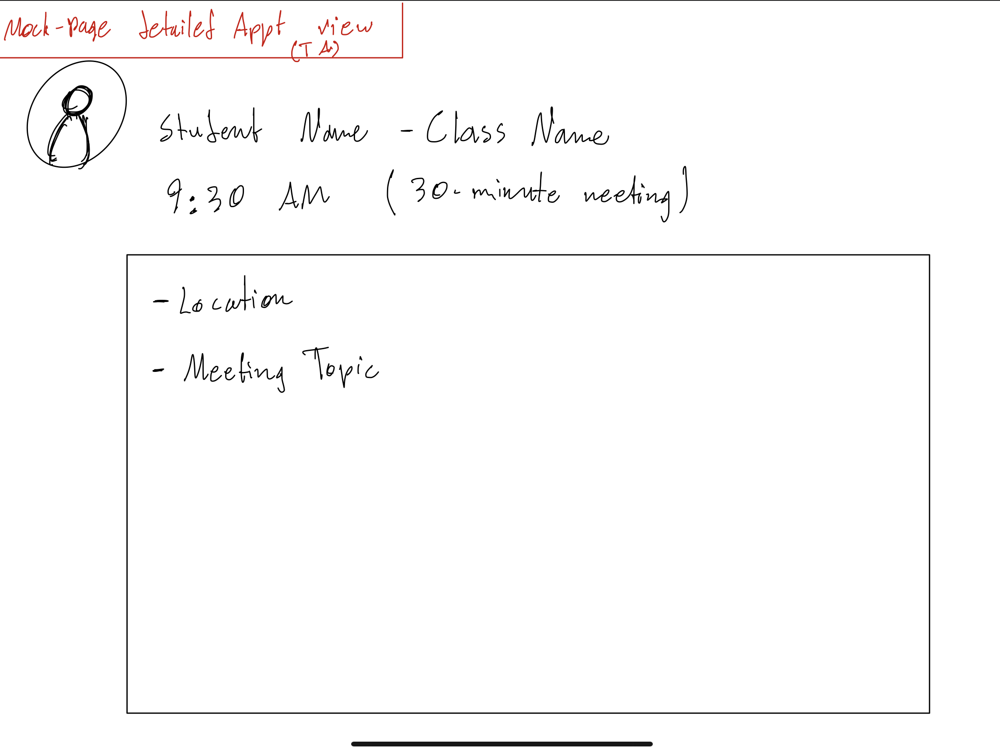
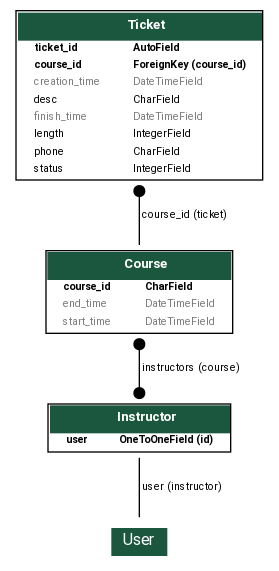

# Our Hour Requirements and Specifications Doc

2023-04-01 / v2.1

  

## Group Members

Eric Harrigan, Karim Matouk, Khalid Shallhoub, Raisa Riddhi, Ritwick Dwivedi, Yinzhou Wen

  

## Project Abstract

OurHour is a system to manage office hours sessions in college courses.

The system aims to serve as a bridge to effectively connect students and

their respective TAs through offering ease of access to office hours sessions and

better time management for all users. The system aims to allow TAs to easily access their office hours

schedule and manage any upcoming sessions scheduled with students. This will be acheived by giving TAs

access to information such as the number of overall sessions available for a certain day, names of students,

any session information (i.e single session vs group), and many other features. The system also aims to serve

students through allowing ease of access to office hours' scheduling through many features such as

being able to view office hours session's type, time and date, and allow private communication with

TAs for issues regarding an upcoming session.

  

## Document Revision History

  

| Date / Version    | Comments                                 |

| ----------------- | --------                                 |

| 2023-02-23 / v1.0 | Initial                                  |

| 2023-02-23 / v1.1 | Added to customer, and user requirements |

| 2023-02-23 / v1.2 | Added project abstract & security reqs   |

| 2023-02-23 / v1.3 | Added user interface requirements        |

| 2023-03-08 / v1.4 | Added system requirements                |

| 2023-03-09 / v1.5 | Added ERD to Specifications              |

| 2023-03-09 / v1.6 | Added mockup pages                       |

| 2023-04-01 / v2.0 | Updated ERD to match real DB schema      |

| 2023-04-02 / v2.1 | Added UML diagram                        |

  
  

## Customer

The primary customers of Our Hour are undergraduate students and instructors at UW-Madison. Although

OurHour was developed to solve logistical issues with office hours for CS courses at UW, it is

likely that other departments and universities could use Our Hour to streamline their own office hours

as well. The instructors include professors and TAs who need to communicate with the undergraduate students

during office hours of that course.

  
  

TODO: A brief description of the customer for this software, both in general (the population who

might eventually use such a system) and specifically for this document (the customer(s)

who informed this document). Every project is expected to find an external customer

(i.e., not you). Requirements should not be derived simply from discussion among team

members. Ideally your customer should not only talk to you about requirements but also

be excited later in the semester to use the system

  

## User Requirements

  

1. Sign Up Form

    + Students will scan a QR code that will bring them to a webform where they can enter in their

      information, such as:

        + Name

        + Contact info **Phone/Email?**

        + Brief description of their question/problem

        + **Maybe give students the option of #tagging their questions so they can be more easily grouped?**

          **Students could be prompted to supply their own tag, or choose from a tag that is already associated**

          **with another student's open ticket. Not sure about this, might be annoying, and would have to depend on**

          **students to supply accurate info**

        + **Estimation of how long a student's issue will take to resolve - maybe short/medium/long?**

        + Is the issue private vs not private? Does the student mind if they are helped alongside other students with similar issues?

    + After submitting their ticket, a student will receive a confirmation text/email that contains a link to manage their

      ticket.

2. Manage Ticket Page

    + THe student's confirmation text message will include a link to a page where they can manage their ticket. On this page they can:

        + Cancel their ticket.

        + View their spot in line and/or a rough estimate of their wait time

3. Notify the Student when it's their turn!

    + Send the student a text message when an instructor is ready to meet with them.

    + This can also be viewed on the manage ticket page.

    + The text will tell the student:

        + Where to meet the instructor

        + **How much time the student has to meet the instructor before their place in line is given up**

4. Management Portal for Instructors

    + After authenticating with a username and password, instructors will be brought to a portal where they can manage the office hours.

      Actions that are available on this page include:

        + View the queue of tickets that students have created.

        + View the details for a particular ticket.

        + Search descriptions and tags of the currently active tickets.

        + Select tickets to notify that it is their turn.

        + Remove tickets from the queue

        + Open and close the office hours

            + If the instructor has to leave, they need to be able to prevent more students from adding tickets.

TODO: This section lists the behavior that the users see. This information needs to be

presented in a logical, organized fashion. It is most helpful if this section is organized in

outline form: a bullet list of major topics (e.g., one for each kind of user, or each major

piece of system functionality) each with some number of subtopics

  

## Use Cases

  

### Must Have

  

| Name            | Create Ticket                                                                                                                                                        |

| --------------- | -------------------------------------------------------------------------------------------------------------------------------------------------------------------- |

| Actors          | Students                                                                                                                                                             |

| Triggers        | Student scans the QR code to be brought to the sign up page                                                                                                          |

| Events          | Student types in their name, contact info, a brief description of their problem and some other optional info such as a tag                                           |

| Exit Condition  | All required fields have been filled out and the office hours are open.                                                                                                                            |

| Post Conditions | Information about the ticket has been entered into a database and the system sends a confirmation text.                                                              |

| Accepance Test  | Student receives a confirmation text. When they view their ticket, all info is displayed as it was entered. Instructors are able to view the ticket and its details. The ticket is marked as waiting |

  

| Name            | Confirmation Text                                                                                       |

| --------------- | ----------------------------                                                                            |

| Actors          | Students                                                                                                |

| Triggers        | Student clicks "Create Ticket" on the sign up page                                                      |

| Events          | Student receives a confirmation text with a link where they can manage their ticket                     |

| Exit Condition  | The ticket arrives successfully indicating that the student correctly inputted their phone number       |

| Post Conditions | The student is able to click the link and it brings them to the page where they can manage their ticket |

| Accepance Test  | The message actually arrives, and the link goes to the page for the correct ticket                      |

  

| Name            | Cancel Ticket                                                                                                                                                                       |

| --------------  | -                                                                                                                                                                                   |

| Actors          | Students                                                                                                                                                                            |

| Triggers        | Student clicks "Cancel Ticket" on their ticket management page                                                                                                                      |

| Events          | Page prompts the student to confirm that they want to cancel their ticket                                                                                                           |

| Exit Condition  | Student confirmed that they wish to cancel their ticket                                                                                                                             |

| Post Conditions | Student is redirected to the "Create Ticket" page                                                                                                                                   |

| Accepance Test  | If an instructor tries to view the cancelled ticket, it will have a status of "cancelled". The student is no longer able to view their ticket if they go to their confirmation page |

  

| Name            | Create instructor account                                                                                                                                         |

| --------------  | -                                                                                                                                                                 |

| Actors          | Instructors                                                                                                                                                       |

| Triggers        | Instructor clicks create account on the office hours management page                                                                                              |

| Events          | The instructor will be prompted to provide a personal username and password, and also supply a passcode that indicates they are authorized to create new accounts. Notify the instructor if their username/password don't fit the requirements, or the passcode is incorrect. |

| Exit Condition  | The instructor enters a valid username/password (no illegal symbols) and the correct passcode.                                                                                                                                                                |

| Post Conditions | The instructor is notified that the account was created successfuly, then prompted with a link to the home page.                                                                                                                                              |

| Accepance Test  | The new account should be activated - if one supplies the correct username/password combination on the login page, they should be successfully logged in.                                                                                                     |

  

| Name            | Instructor Login                                                 |

| --------------  | -                                                                |

| Actors          | Instructors                                                      |

| Triggers        | Instructor clicks the log in button on the instructor login page |

| Events          | The instructor types in a username and password and clicks log in. Notify the instructor if the username and password combination is invalid                                                               |

| Exit Condition  | The instructor entered a valid username/password combination                                                                 |

| Post Conditions | The instructor is redirected to the office hours management page.                                                                 |

| Accepance Test  | The instructor should be able to access the functions available for instructors on the management page if they entered a correct username/password.                                                           |

  

| Name            | Instructor Logout                                                                                 |

| --------------  | -                                                                                                 |

| Actors          | Instructors                                                                                       |

| Triggers        | Instructor clicks the logout button on the office hours management page                           |

| Events          | The instructor is prompted to confirm that they wish to logout.                                   |

| Exit Condition  | The instructor confirmed that they do want to logout.                                             |

| Post Conditions | The instructor is redirected to the instructor login page.                                        |

| Accepance Test  | The instructor shouldn't be able to view the office hours management page until they login again. |

  

| Name            | Notify student their ticket has been chosen                                     |

| --------------  | -                                                                               |

| Actors          | Instructors                                                                     |

| Triggers        | Instructor clicks "notify student" or something similar, while viewing a ticket |

| Events          | The instructor chooses a place to meet the student. The student is notified that their ticket is being serviced, and is told where to go to meet the instructor. The ticket's status is changed to "active".                                                                                 |

| Exit Condition  | The instructor chooses a ticket that has a status of "waiting".                                                                                                                                                                                                                              |

| Post Conditions | The page refreshes, showing the updated information (active status, and the meeting location)                                                                                                                                                                                                |

| Accepance Test  | When the page refreshes, the correct information is shown for the instructor. The student has been notified, and can view that their ticket's status has been changed to active                                                                                                              |

  

| Name            | Start Office Hours                                                                                                                                                                                                            |

| --------------  | -                                                                                                                                                                                                                             |

| Actors          | Instructors                                                                                                                                                                                                                   |

| Triggers        | Instructor clicks start office hours button on the office hours management page                                                                                                                                               |

| Events          | The instructor is prompted to supply an end time for the office hours and clicks "Start office hours". The start time must be in the future, and on todays date.                                                              |

| Exit Condition  | The instructor supplies a valid end time                                                                                                                                                                                      |

| Post Conditions | Students are able to submit new tickets. Instructors are able to view the ticket queue and interact with the tickets. The start office hours button has been replaced with a "change/end office hours" button.                |

| Accepance Test  | The office hours are active, and the correct end time is shown, both on the instructor page, and the ticket status page that is available to students. When that end time arrives, the office hours will automatically close. |

  

| Name            | Change/end office hours                                                                                                                                                                                                                                                                                                                                                                                                                        |

| --------------  | -                                                                                                                                                                                                                                                                                                                                                                                                                                              |

| Actors          | Instructors                                                                                                                                                                                                                                                                                                                                                                                                                                    |

| Triggers        | Instructor clicks the "Change/end office hours" button                                                                                                                                                                                                                                                                                                                                                                                         |

| Events          | The instructor is prompted to supply an end time, that is in the future on the current day, or to indicate that they want to end the office hours now. If the instructor chooses to end the office hours now, they are prompted to confirm that choice.                                                                                                                                                                                        |

| Exit Condition  | The instructor supplies a valid end time or confirms that they want to end the office hours.                                                                                                                                                                                                                                                                                                                                                   |

| Post Conditions | If the office hours end time was changed, the site shows the updated end time for both students and instructors. If the office hours were ended, any students that were still in the queue are notified that the office hours have ended and they will not be helped. These tickets are marked as "cancelled".                                                                                                                                 |

| Accepance Test  | If the office hours were updated, the new  end time is available for both students and instructors to view on their respective pages. When the end time arrives, all waiting tickets will be cancelled and those students will be notified of that. Students will not be able to submit tickets after the office hours closes, unless it reopens. If the office hours were closed, that behavior is equivalent to changing the end time to now |

  

| Name            | Cancel Ticket                                                                                                                                                                       |

| --------------  | -                                                                                                                                                                                   |

| Actors          | Instructors                                                                                                                                                                         |

| Triggers        | Instructors click "Cancel ticket" button while viewing a ticket in the queue.                                                                                                       |

| Events          | Instructor is prompted to confirm that they wish to cancel the ticket.                                                                                                              |

| Exit Condition  | Instructor confirms that they wish to cancel this ticket.                                                                                                                           |

| Post Conditions | The student is notified that their ticket has been cancelled.                                                                                                                       |

| Accepance Test  | When the student tries to view their ticket on the manage ticket page, it shows that it is cancelled. If an instructor views the ticket in the queue, its status will be cancelled. |

  

| Name            |   |

| --------------  | - |

| Actors          |   |

| Triggers        |   |

| Events          |   |

| Exit Condition  |   |

| Post Conditions |   |

| Accepance Test  |   |

  
  
  

TODO: Use cases that support the user requirements in the previous section. Every major

scenario should be represented by a use case, and every use case should say

something not already illustrated by the other use cases. Diagrams (such as sequence

charts) are encouraged. Ask the customer what are the most important use cases to

implement by the deadline. You can have a total ordering, or mark use cases with “must

have,” “useful,” or “optional.” For each use case you may list one or more concrete

acceptance tests (concrete scenarios that the customer will try to see if the use case is

implemented).

  

## User Interface Requirements

Most of our input and output is expected to be through text in excpetion to a few graphical

requirements which are related to vieweing and editing the overal schedule.

One requirement would be a schedule which displays at least the 7 days of a single week

which shows any upcoming sessions. This graphical aspect would require individual labels

(Mon-Sun) and time periods (i.e 9 AM - 9 PM). This schedule would also require to be

color-coded for it to be easily readble to students and TAs (i.e blue indicates individual

session while red indicates a group session) along with a color table indicating which color

represent what in the table.

  

Graphical input would vary depending on user input. We expect TA input to be highly flexible within

the OurHour scheduling aspect of the system.

For instance, they can insert precise start-end dates for available scheduling times, edit

student/class name, or send real-time custom notifications to students. The majority

of user-input for TAs is expected to be graphically implemented through the usage of text

boxes to receive input to acheive high flexibility for TAs.

  

For students, we expect much less flexibility. Text boxes will be used to receive input

for aspects such as session notes to TAs. However, the majority of graphical components

for students would be through mostly fixed gracphical components based on information

exctracted from TAs. For instance, a drop-box list would be used when students attempt

to schedule a session with a TA which contains TA names, dates, and session type.

Another aspect for students would be relating to the status of students' arrival to

sessions. For instance, confirmation of booking a session, cancelling a session, or

editing the time of a specific session would require functioning buttons.

  

To keep the system secure, inputted username must be visible while any passwords set

by users must be hidden to keep user-input more secure while also setting a "confirm

password" box to ensure the user remembers their password. Additionally, users must

be promted a set of rules for set passwords to ensure they are not easy to guess.

  

For all users, we expect confirmation messages to be prompted to users. For instance,

when a user has booked a session, a message box highlighting the booked time/date should

pop-up to the user to confirm their booked time.

  

For both TAs and students, message boxes are also essential to implement for system-generated

errors. We expect pop-up boxes containing error messages, such as scheduling conflict errors,

to be shown through such message boxes.

  

### Rough Mockup Illustrations

  

  

  
  

## Security Requirements

There are multiple security requirements for OurHour. Firstly, it is important to store

usernames and passwords for both TAs and students in a secure manner as scheduling information

shoul remain confidential especially with sessions with individual students who might

have special concerns. The main identification method for accessing the system is

through a user-generated account that has additional information such as name, department,

class name. Such additional information is also vulnerable and should be secured.

  

OurHour aims to use the internet as a method to access the system. Hence, the system

would be vulnerable to DDoS attacks by default. It is essential to protect the system

from such attacks.

  

OurHour also has privacy and confidentiality issues rgarding data access between its users.

For instance, any notes provided regarding an upcoming office hours sessions should only be seen

by the respective TA and no other TAs (unless otherwise stated by the TA/Adminstrator)

and no other students sharing the system.

  

Any successful attempt to jeapordize any of the mentioned security requirements

would ruin the experience of the users of the system; hence, it is crucial

to proerly implement the mentioned security requirements. For instance, unauthorized

access to TA/student account might lead to scheduling conflicts or unwanted

cancellation of session.

  

## System Requirements

Server Requirements:

  1. GitLab (Version Control)

  2. Database for Queue and Authentication (To be decided)

User Device Requirements:

  1. Web Browser

  2. Internet Connectivity (Cellular or Wifi)

  3. Minimum Storage: N/A

  4. Minimum RAM: N/A

  

Database will have to store the current status of each queue for available office hours, along with

authentification details for the TA. By connecting the database to the front end using APIs, students

will be able to join the queue or cancel their appointments right from the website. Queues and options

for the students will be available once the TA has set up their account and has specified their office

hours in the app. The web app was a superior choice than a native app for any specific device as it is

easily accessible for anyone, no matter the device. Also, it would be a lot less intensive on network

speeds than downloading an app on a mobile device. At this moment, the minimum physical requirements

for a user to run the web app are not defined.

  

## Test Server

  

- Ipv4: 23.224.49.101

- Username: root

- Password: kfHRy8WQ1tuTTqyX

- System: CentOS 8

  

## Domain Details

  

### Details

  

- Domain Name: ourhour.com

- Domain Registrar: DnsPod

- Expiration Date: 2024/03/24

- Domain Name Server: http://betsy.dnspod.net/

  

### DNS Records

  

#### Record 1

  

- Record Type: A

- Host Record: @

- Time to Live (TTL): 600 seconds

- Record Value: 23.224.49.101

  

## Specification

### Entity Relationship Diagram

  

### UML Use Case Diagram

  
  

TODO: A detailed specification of the system. Every possible execution should be in the

specification, though not every aspect need be covered in extraordinary depth. UML, or

other diagrams, such as finite automata, or other appropriate specification formalisms,

are encouraged over natural language

  

## Notes

Any **bolded** text needs clarification and/or confirmation from other group members.
